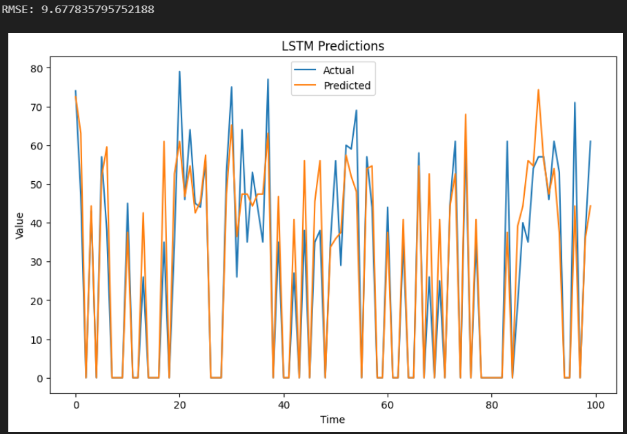
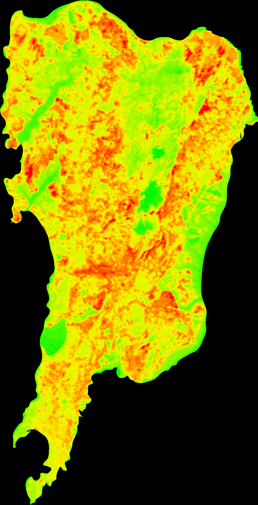
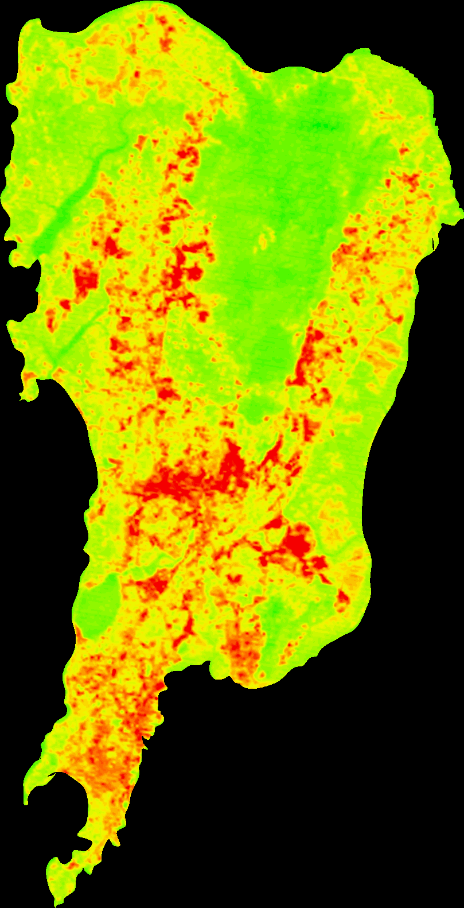
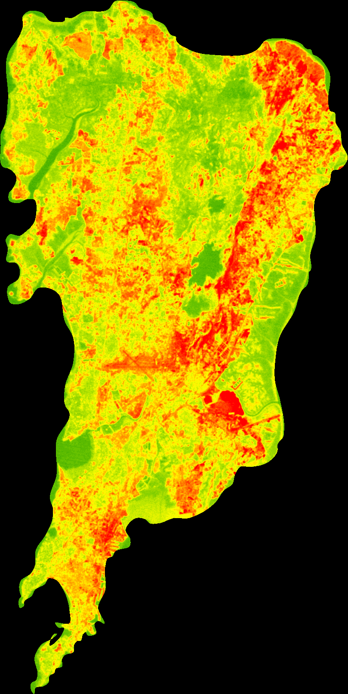
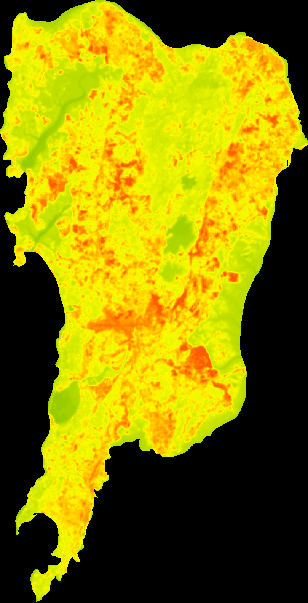

# Surface Thermal Temperature Prediction


This repository contains the code and resources for the **Surface Thermal Temperature Prediction** project, which focuses on predicting surface temperatures using thermal images. The project leverages image processing techniques, machine learning (specifically LSTM), and temperature scaling to achieve its objectives.

## Table of Contents
- [Introduction](#introduction)
- [Project Workflow](#project-workflow)
- [Getting Started](#getting-started)
- [Code Structure](#code-structure)
- [Data](#data)
- [Usage](#usage)
- [Results](#results)
- [Screenshots](#screenshots)
- [Contributing](#contributing)

## Introduction
The **Surface Thermal Temperature Prediction** project aims to predict surface temperatures using thermal images of the Mumbai map. This involves a multi-step process including image processing, data extraction, temperature scaling, machine learning training (using LSTM), and image reconstruction. The images is obtained from Landsat 8 from [USGS EarthExplorer](https://earthexplorer.usgs.gov/). 

## Project Workflow
1. Input: Thermal images of the Mumbai map in .bmp format.
2. Image Processing: The OpenCV library is used to process the images, extracting RGB values of each pixel.
3. Data Preparation: A custom temperature scale is created for data scaling.
4. Machine Learning: LSTM (Long Short-Term Memory) algorithm is employed to train the model. Temperature values are used as inputs, and the model predicts temperatures as outputs.
5. Image Reconstruction: The output temperature values are utilized to reconstruct the thermal image of the Mumbai map for the year 2030.

## Getting Started
To get started with the project, follow these steps:

1. Clone the repository:
   ```sh
   git clone https://github.com/aniketparate/Surface-Thermal-Temp-Prediction.git
   ```
2. Install the required dependencies mentioned in `requirements.txt`.

## Code Structure
The project's code is organized as follows:

- `final.ipynb`: This Jupyter Notebook contains the main implementation of the LSTM algorithm along with the reconstruction algorithm.
- `code/`: This directory contains separate `.py` files for individual tasks, which are combined in `final.ipynb`.
- `data/`: This directory contains the generated CSV file and input thermal images.

## Data
The `data/` directory contains the resources used in the project:

- `original/`: The sub-directory holds the csv files containing the extracted RGB values and input images.

## Usage
1. Follow the instructions in `final.ipynb` to run the LSTM algorithm and the reconstruction process.
2. You can modify parameters, model architecture, or other settings as needed.

## Results
The project's main output is the predicted surface thermal temperature of the Mumbai map for the year 2030. The reconstructed image will provide a visual representation of these predicted temperatures.

## Screenshots
LSTM Prediction and RSME


Input image
|2000 Feb|2010 Oct|2020 Feb|
|----|----|----|
||||

Output image
|2030|
|----|
||

## Contributing
Contributions to the project are welcome! If you'd like to contribute, please follow the standard GitHub workflow of forking the repository and creating a pull request.